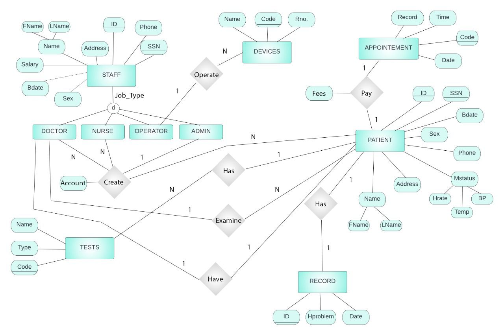

# Cardiology department app

## Table of contents:

- [DataBase Diagram](#database-diagram)
- [Project Steps](#project-steps)
- [Team](#team)

  
### DataBase Diagram

### project Steps
*First: creating tables*
>create the following tables:
* Admin table
* Doctor table
* Patient table
* Appointment table
* contact us table
* Patient-record table
>
*Second: creating pages*
* Register page
* Add doctor
* Add patient
>Explanation:
>They are responsible for creating accounts for Admins of the department.
Through it, Admin can add doctor or patient profile
>Needed information:
>username, email, password, salary, birth date, ssn, address, id
>
* Login page
>Explanation:
>1. login as Admin: should begin with one to identify the admin
>2. login as Doctor: should begin with two to identify the doctor
>3. login as Patient: should begin with three to identify the patient
>
>Needed information:
password, id
>
* Edit admin
* Edit doctor
* Edit patient
>Explanation:
>it allows anyone of the users to edit any information in thier profile
>
* Delete doctor
* Delete patient
>Explanation:
>it allows admin to delete profile of doctor or patient from the system permenantly
>
* Appointement page
1. create appointment:
>needed information: 
>patient name, doctor name, id of the patient, describtion of what the patient need  
2. show appointment:
>
>Explanation: 
>it shows the appointment schedule in both patient and doctor accounts 
>
* Record page
1. upload record:
>admin can upload any record to the patient account  
2. show record: 
>it shows the record the admin uploaded for this patient
> 
* profile page  
>Explanation:
>it shows the information of each user in cardiology department
* Additional page  
>Home page, Devices page, About us, Contact us
>

### Team

First Semester - Biomedical Digital Signal Processing (SBE3110) class project created by:

| Team Members' Names                                  | Section | B.N. |
| ---------------------------------------------------- | :-----: | :--: |
| [Sama Mostafa](https://github.com/SamaMostafa1)         |    1    |    |
| [Doha Eid](https://github.com/doha-eid)       |    2    |    |
| [Misara Ahmed](https://github.com/Misara-Ahmed)       |    2    | 43   |
| [Rahma Abdelkader](https://github.com/rahmaabdelkader2) |    1    |  31  |
| [Yousr Ashraf](https://github.com/YousrHejy)       |    2    |  54  |
| [Arwa Esam](https://github.com/)       |    1    |    |

### Submitted to:

- Dr. Ahmed Hesham & Eng. Eman
  All rights reserved © 2023 to Team 2 - Systems & Biomedical Engineering, Cairo University (Class 2024)
> 
